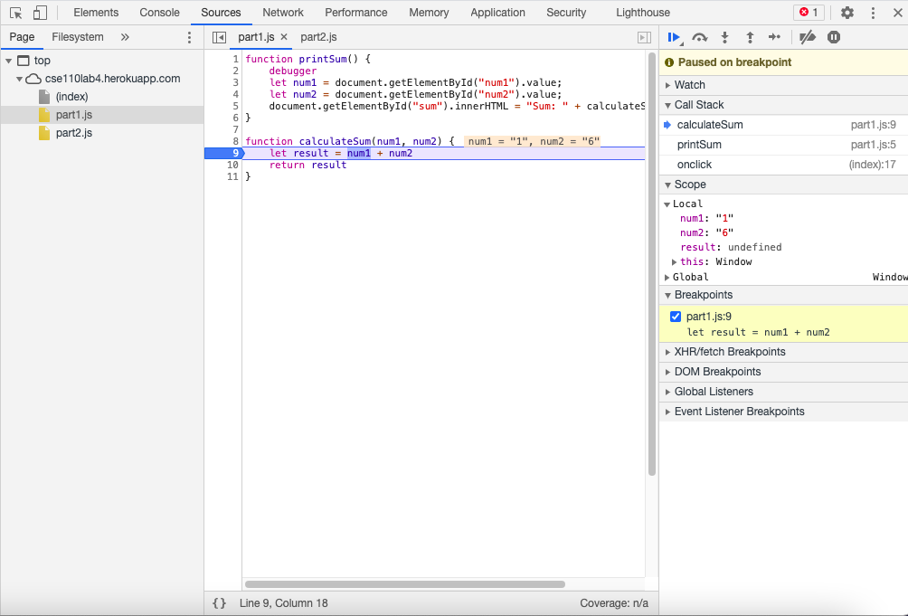
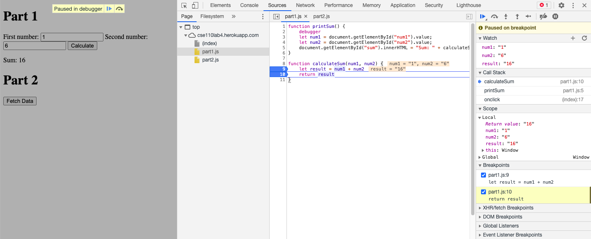
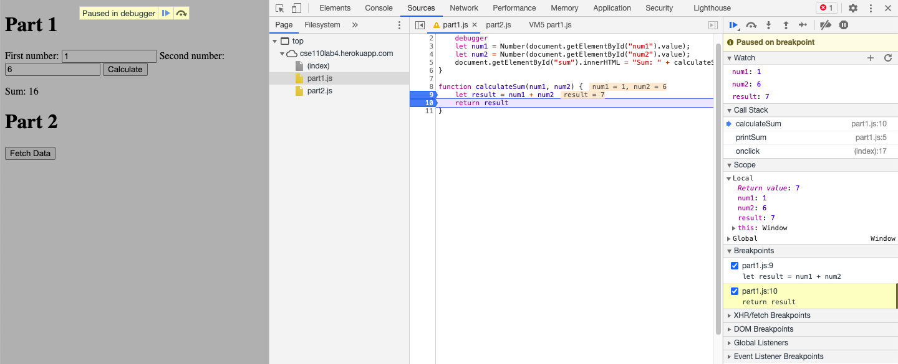
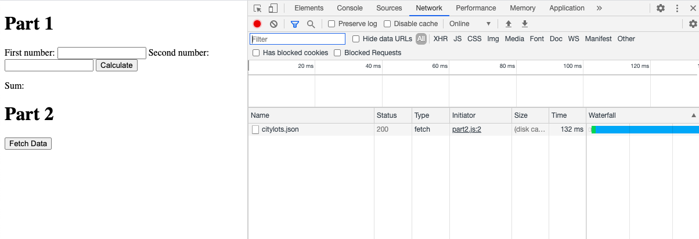

# Part3: Debugging using the DevTools
## DevTools - Debugging
### Break  
  
  
### Watch  
  
From this image below, you can see that the data type of result is a string.  
  

### Fix 
   
The bug is that `num1` and `num2` are both of data type string, so when they get added together it'll just append `num2` to `num1`. I fixed this problem by casting the values of `num1` and `num2` to integers using `Number()`.  
  
  
  
## DevTools - Network Tab  
  
1. citylots.json  
2. part2.js  
3. 11.7 MB  
4. 132 ms  
5. Mozilla/5.0 (Macintosh; Intel Mac OS X 11_1_0) AppleWebKit/537.36 (KHTML, like Gecko) Chrome/88.0.4324.96 Safari/537.36
6. Apache
7. Tue, 26 Jan 2021 22:14:13 GMT
8. application/json
9. fetchData